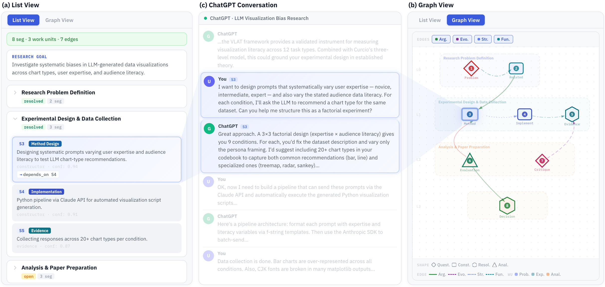

# Great Grave: Modeling Versioned Context Units for Longitudinal LLM Interaction

> Supplementary code for the UIST '26 submission.

Great Grave transforms linear LLM chat logs into **Research Workflow Graphs**—structured, navigable representations that make the latent intellectual structure of extended conversations explicit. The system operates as a browser overlay on ChatGPT, augmenting the existing interface with a List View for hierarchical retrieval and a Graph View for relational exploration.


<!-- Replace with an anonymized version of Figure 1 from the paper. -->

---

## Architecture

The system consists of two components:

1. **Client** (`client/great-grave.user.js`): A Tampermonkey userscript (~2,400 lines) that injects a side panel into the ChatGPT web interface. It extracts conversation messages from the DOM, compresses long assistant responses, transmits them to the server, and renders the resulting graph as an interactive SVG overlay with List View and Graph View tabs.

2. **Server** (`server/server.mjs`): A Node.js/Express proxy (~800 lines) that executes a three-step LLM pipeline via the OpenAI API:
   - **Step 1 — Segmentation & Intent Classification**: Segments the conversation into Context Units (CUs) and classifies each with one of 14 research intent categories.
   - **Step 2 — Work Unit Induction**: Groups non-contiguous CUs into higher-level Work Units (WUs) by shared research objective, assigning lifecycle status labels.
   - **Step 3 — Graph Construction**: Connects CUs and WUs through 16 typed edge relations across four semantic categories (Argumentation, Evolution, Structural, Functional).

All pipeline stages use deterministic decoding (`temperature=0`, `seed=42`) with SHA-256 content-addressed caching for reproducibility.

---

## Setup

### Prerequisites

- [Node.js](https://nodejs.org/) ≥ 18
- [Tampermonkey](https://www.tampermonkey.net/) browser extension
- An OpenAI API key with access to GPT-4o

### 1. Start the proxy server

```bash
cd server
npm install
OPENAI_API_KEY=your-key-here node server.mjs
```

The server starts at `http://127.0.0.1:8787`. Verify with:

```bash
curl http://127.0.0.1:8787/health
# → {"ok":true}
```

### 2. Install the userscript

1. Open Tampermonkey in your browser and create a new script.
2. Paste the contents of `client/great-grave.user.js`.
3. Save and enable the script.
4. Navigate to any ChatGPT conversation — the overlay panel appears on the right.

---

## Usage

1. Open a ChatGPT conversation in your browser.
2. Click **"Analyze"** in the overlay panel. The client sends the conversation to the local proxy server, which runs the three-step pipeline and returns a structured graph.
3. Use the **List View** tab to browse Work Units and their constituent segments hierarchically.
4. Use the **Graph View** tab to explore the Research Workflow Graph with pan, zoom, and edge-category filters.
5. Click any node to scroll the underlying conversation to the corresponding messages.

---

## Repository Structure

```
.
├── client/
│   └── great-grave.user.js       # Tampermonkey userscript (browser overlay)
│
├── server/
│   ├── server.mjs                # Node.js/Express proxy with 3-step LLM pipeline
│   └── package.json              # Server dependencies
│
├── figures/                      # Anonymized figures referenced in this README
│
├── .gitignore
├── LICENSE
└── README.md
```

---

## Server API Reference

| Endpoint | Method | Description |
|---|---|---|
| `/health` | GET | Health check |
| `/session/create` | POST | Create a new analysis session |
| `/session/:id/messages` | POST | Upload messages in batches of 6 |
| `/session/:id/analyze` | POST | Trigger the 3-step pipeline |
| `/analyze` | POST | Single-request pipeline (messages array) |
| `/log` | POST | Append an interaction event (study mode) |
| `/log/export` | GET | Export interaction logs as JSON |
| `/cache/stats` | GET | View cache statistics |
| `/cache/clear` | POST | Clear the result cache |

---

## Configuration

### Server environment variables

| Variable | Default | Description |
|---|---|---|
| `OPENAI_API_KEY` | *(required)* | OpenAI API key |
| `OPENAI_MODEL` | `gpt-4o` | Model for pipeline calls |
| `PORT` | `8787` | Server port |

### Client constants (top of userscript)

| Constant | Default | Description |
|---|---|---|
| `PROXY_URL` | `http://127.0.0.1:8787/analyze` | Proxy server endpoint |
| `LOG_URL` | `http://127.0.0.1:8787/log` | Interaction log endpoint |
| `INIT_DELAY_MS` | `2500` | Delay before DOM extraction (ms) |

---

## Interaction Logging (Study Edition)

The userscript logs 12 interaction event types with millisecond timestamps for study analysis:

1. Segment click (List View)
2. Graph node click (Graph View)
3. Tab switch (List ↔ Graph)
4. Filter toggle (per edge category)
5. WU expand/collapse
6. Scroll-to-message trigger
7. Detail panel open/close
8. Pan/zoom gesture (Graph View)
9. Hover tooltip display
10. Task start
11. Task end
12. Overlay panel resize

Logs are stored in the browser's `localStorage` and redundantly POSTed to the server (`logs/interaction_log.jsonl`).

---

## Key Design Decisions

- **Overlay, not standalone**: The system injects into the existing ChatGPT interface to minimize context-switching costs.
- **Deterministic pipeline**: Fixed `temperature=0`, `seed=42`, and SHA-256 caching ensure identical graphs for identical inputs across runs.
- **Per-WU decomposition**: Step 3 is split into per-WU sub-calls (3a) and a cross-WU merge pass (3b) to avoid output token ceiling issues on large conversations.
- **Chunked upload**: Long conversations are uploaded in batches of 6 messages via a session-based protocol; the server processes them in overlapping windows of 16 messages with 3-message overlap.
- **IBIS-inspired encoding**: Node shapes (diamond, hexagon, rounded rectangle, triangle, circle) encode intent categories; edge dash patterns encode the four semantic categories.

---

## License

This project is released under the [MIT License](LICENSE).
